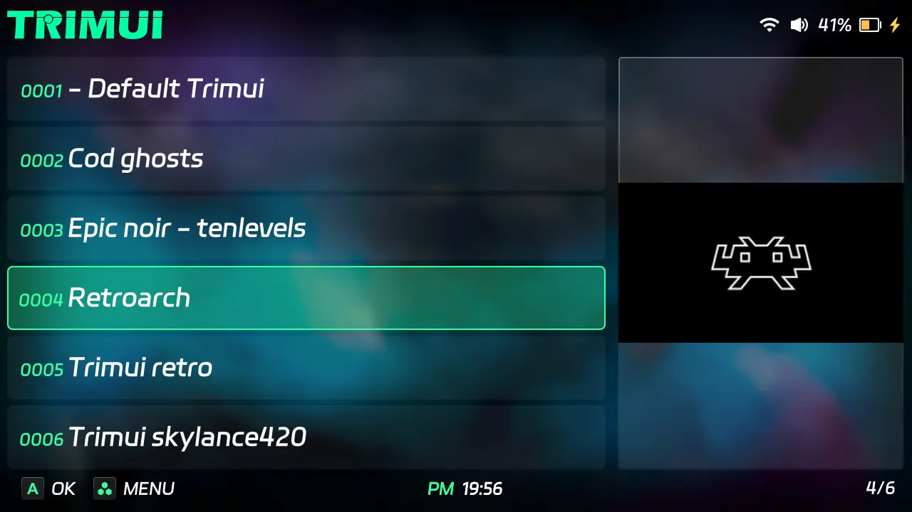

  BootLogo by Schmurtz
=========================

An app for easy boot logo flashing on TrimUI Smart Pro

How to install :
===================================================================
[Download](https://download-directory.github.io/?url=https%3A%2F%2Fgithub.com%2Fschmurtzm%2FTrimUI-Smart-Pro%2Ftree%2Fmain%2FBootlogo)

Copy Apps, Emus and System folders to the root of your SD card, then run the app "BootLogo".

How to use with your own images :
===================================================================
Copy your own .bmp image files in "Apps\BootLogo\Images".
Run the "BootLogo" application.

Some rules to respect to create your own boot logo :
===================================================================
The logo must be in .bmp format
not exceeding 6 MB
Ideally a resolution of 1280px by 720px.  A larger dimension (width or length) is not possible.

Additional information :
===================================================================
Bootlogo app will check these parameters automatically : 
- If the resolution is 1280x720 (less is OK, more will stop the flash process)
- Check if the file is really a BMP (bitmap) file (to avoid renaming with bad extension)
- Check if the file size is inferior to 6MB
TrimUI default stock bootlogo is included.
Press MENU -> Edit to hide the "_BootLogo" item in the emulator list.

Special thanks to Kloptops for sdl2imgshow tool used in this app  :
===================================================================
https://github.com/kloptops/sdl2imgshow