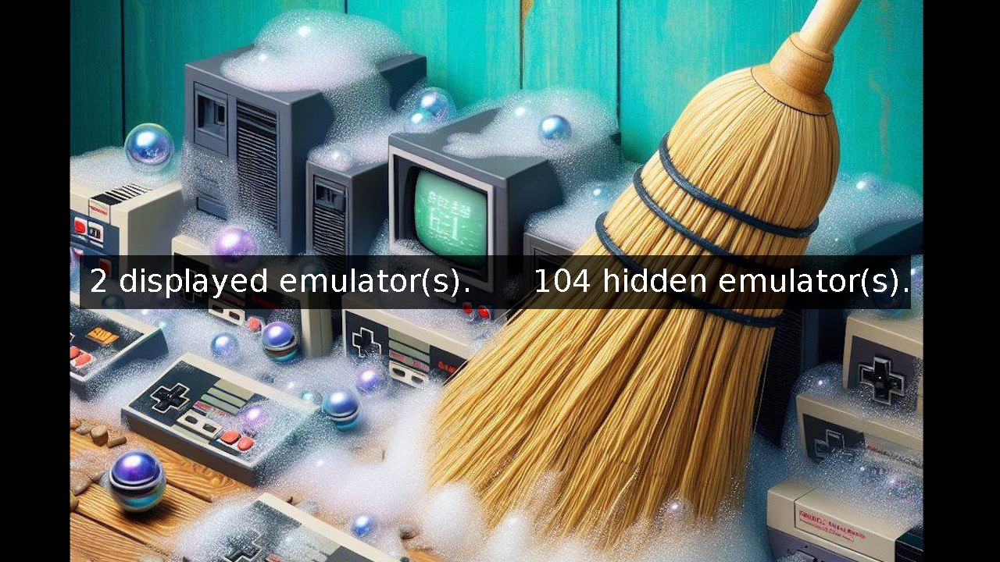

  EmuCleaner by Schmurtz
=========================

EmuCleaner is an app which will hide all the emulators which have no roms, of course it also enable all the emulators with roms at the same time. 
Emucleaner is very usefull to :
 - Avoid to have a lot of consoles in the list which are empty
 - Enable the right emulators just after having added new roms.

How to install :
===================================================================
Copy Apps and System folders to the root of your SD card, then run the app "EmuCleaner".

Additional information :
===================================================================
EmuCleaner will edit "Emus/show.json" to show or hide emulators, which means that it uses the same way as the native emulators selector system offered with stock OS, so you'lll be still able to hide/show emulators manually from stock MainUI after using EmuCleaner.

Special thanks to Kloptops for sdl2imgshow tool used in this app  :
===================================================================
https://github.com/kloptops/sdl2imgshow