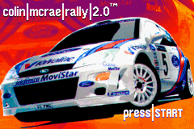
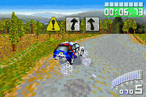
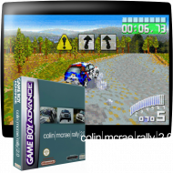
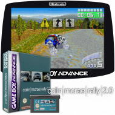

  Scraper by Schmurtz
=========================

This is a scraper based on screenscraper api.

It is a port of Onion Scraper but simplified and without UI.

So you have to run it by command line. For example:

To change the default scraper settings, you have to edit the config file (`System/etc/scraper.json`) manually:


```
{
  "screenscraper_username": "",   -> your screenscraper account username, optional but recommended for faster scraping.
  "screenscraper_password": "",   -> your screenscraper account password, optional but recommended for faster scraping.
  "ScreenscraperMediaType": "box-2D",   -> choose between : screenmarqueesmall, box-3D, box-2D, ss, sstitle, wheel, mixrbv1, mixrbv2
  "ScreenscraperRegion": "us"     -> priority region (see below)
}
```


## Available Regions:

- World 0)		
	- afr - African continent
		- za - South Africa
	- ame - American continent
		- ca - Canada
		- cl - Chile
		- br - Brazil
		- mex - Mexico
		- us - USA
		- pe - Peru 
	- asi - Asia 	
		- cn - China 
		- kr - Korea 
		- jp - Japan 
		- tw - Taiwan 
	- eu - Europe 	
		- bg - Bulgary 
		- de - Germany 
		- dk - Denmark 
		- sp - Spain 
		- fi - Finland 
		- fr - France 
		- gr - Greece 
		- hu - Hungary 
		- it - Italy 
		- no - Norway 
		- nl - Netherlands 
		- pl - Poland 
		- pt - Portugal 
		- cz - Czech Republic 
		- uk - United Kingdom 
		- sk - Slovakia 
		- se - Sweden 
	- Middle East 	
		- ae - United Arab Emirates 
		- il - Israel 
		- kw - Kuwait 
		- tr - Turkey 
	- Oceania 	
		- au - Australia 
		- nz - New Zealand 
	- ru - Russia 	
	- Custom 	
	- ss - ScreenScraper 	


If your region is not available then parent regions will be tested then commonon alternative , for example: fr -> eu -> world -> us


## Medias description: 

| Name        | Preview example                                   |
| ------------------------- | ----------------------------------- |
| Box Art                   |      |
| Screenshot - Title Screen ||
| Screenshot - In Game      | |
| Box Art - 3D              |      |
| Wheel                     |      |
| Marquee                   |    |
| ScreenScraper Mix V1      |       |
| ScreenScraper Mix V2      |       |


## How to install:

[Download](https://download-directory.github.io/?url=https%3A%2F%2Fgithub.com%2Fschmurtzm%2FTrimUI-Smart-Pro%2Ftree%2Fmain%2FScraper)

Copy System folder to the root of your SD card, then run the command line (from SSH, Telnet, uart, or any else)


## How to use:

```
/mnt/SDCARD/System/usr/trimui/scripts/scraper/scrap_screenscraper.sh MD
```

## Additional information :

It is recommended to set a scraper account for efficient scraping.

